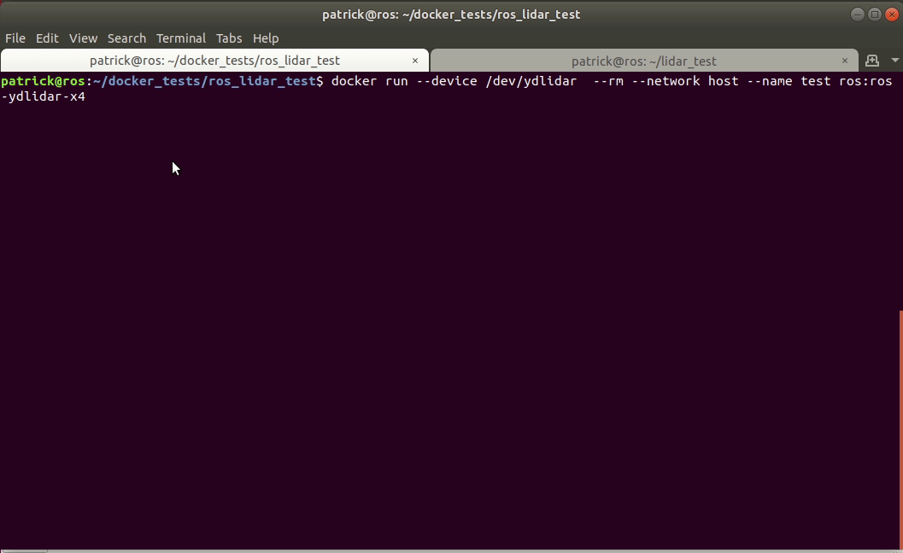

# ros-ydlidar-x4-docker
<p align="center">
    
</p>


### Overview
This repo demonstrates launching a containorized ROS node that communicates with a lidar sensor over USB. While some of this information is specific to the YDLidar x4, much of the information is generally applicable.

Specifically this guide can help you with the following:
* Introduction to running ROS within a docker container
* Creating a reusable dockerfile that downloads an ROS package via git
* Allowing for bidirectional communication between a docker container and docker host hardware
* Using Rviz to visualize ROS data that originates from an containorized ROS node

---- 
### Prerequisites

* Assume host is running Ubuntu 18.04 (specified distro for ROS Melodic release)
* [Install docker engine](https://docs.docker.com/engine/install/ubuntu/)
* [ROS Melodic installed](http://wiki.ros.org/melodic/Installation/Ubuntu) or at least RVIZ
* Working YDLidar x4 lidar sensor


---

### Getting Started
* Clone this repository
	```sh
	git clone git@github.com:patrick--/ROS-YDLidar-x4-docker.git
	```

* If you haven't gotten the Lidar working on the host OS prior to now, go ahead and run lidar_init_env.sh to create the `udev` rules and appropriate `/dev` symlinks for the lidar
	```sh
		cd ROS-YDLidar-x4-docker
		sudo chmod +x lidar_init_env.sh
		sudo sh +x lidar_init_env.sh
	```

* Build image from the provided Dockerfile
	```sh
	cd ROS-YDLidar-x4-docker
	docker build --tag ros:ros-ydlidar-x4 .
	```

* Launch the container on the host network and ensure to share `/dev/ydlidar`
	```sh
	docker run --device /dev/ydlidar --rm --network host --name ydlidar_x4_docker_test  ros:ros-ydlidar-x4
	```
  **Note**: We use the default host network here for ease of use. If you need to isolate network communication between containers and or your host, you will need to [create a network](https://docs.docker.com/engine/reference/commandline/network_create/).


* In another tab simply launch rviz with default settings
   ```sh
   rosrun rviz rviz
   ```

* Change the `Fixed Frame` drop down to `laser_frame` and add the `LaserScan` topic to start seeing lidar data in real time.